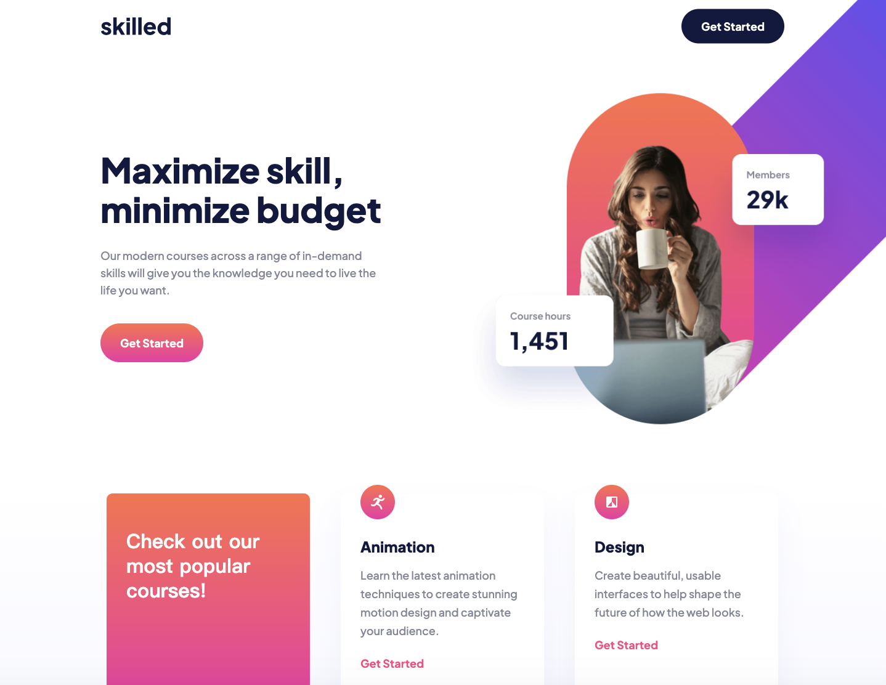

# Skilled E-learning Landing Page

This project is a responsive website, with optimal layout for mobile, tablet and desktop. Built with HTML and CSS.

## Table of contents

- [Overview](#overview)
  - [The challenge](#the-challenge)
  - [Screenshot](#screenshot)
- [My process](#my-process)
  - [Built with](#built-with)
  - [What I learned](#what-i-learned)
  - [Continued development](#continued-development)
- [Acknowledgments](#acknowledgments)

## Overview

### The challenge

Users should be able to:

- View the optimal layout depending on their device's screen size
- See hover states for interactive elements

### Screenshot

Desktop Layout



Tablet Layout


Mobile Layout


## My process

### Built with

- Semantic HTML5 markup
- CSS custom properties
- Flexbox
- Mobile-first workflow

### What I learned

- Scale and Position of the Header Image

The biggest challenge for this project is how to achieve the desirable effect for the header image in responsive layout.

The obstacles come in many ways:

1. Use Scale to Right the Proportion

The assets for the header image contain a lot of white spaces, so one has to use scale to make it proportional to the webpage.

```css
.hero-img {
  width: 100%;
  height: auto;
  transform: scale(1.25);
}
```

2. How to Use Absolute Positioning (and Set the Right Relative Positioned Ancestor)

The toughest challenge is the positioning of the header image in tablet and desktop layout. I had a hard time deciding which element should be set to absolute and which should be set relative.

In my solution, I set the container to relative, and set both the image wrapper and the image itself to absolute, so that the image will be fixed even if the screen width changes (since the image has a lot of white space, if one doesn't set the image to absolute, it will kind of flow in the image wrapper).

Below is the example for tablet layout.

```css
.container {
  position: relative;
  max-width: 1023px;
  overflow-x: hidden;
  overflow-y: hidden;
}

.header-img {
  position: absolute;
  width: 100%;
  height: 100%;
  margin-top: 0px;
  overflow: visible;
}

.hero-img {
  position: absolute;
  top: -60px;
  right: -260px; 
  width: 656.52px;
  height: 500px;
  object-fit: contain;
  transform: scale(1.5);
}
```

### Continued development

Here are some parts that need to be fixed.

- Header Image Collides with Words

I've set the z-index to -1, so that the image hide below the words when colliding. Still, not the best result.

- 'Get Started' Couldn't Stick to Bottom of the Card

I've tried setting the card to flex, and using margin-top: auto on 'Get Started' button, but so far couldn't find a solution to align the button to the bottom of the card.

Here is an example.


Any feedback or advice is highly welcomed.

## Acknowledgments

### Frontend Mentor - Skilled e-learning landing page solution

This is a solution to the [Skilled e-learning landing page challenge on Frontend Mentor](https://www.frontendmentor.io/challenges/skilled-elearning-landing-page-S1ObDrZ8q). Frontend Mentor challenges help you improve your coding skills by building realistic projects.

